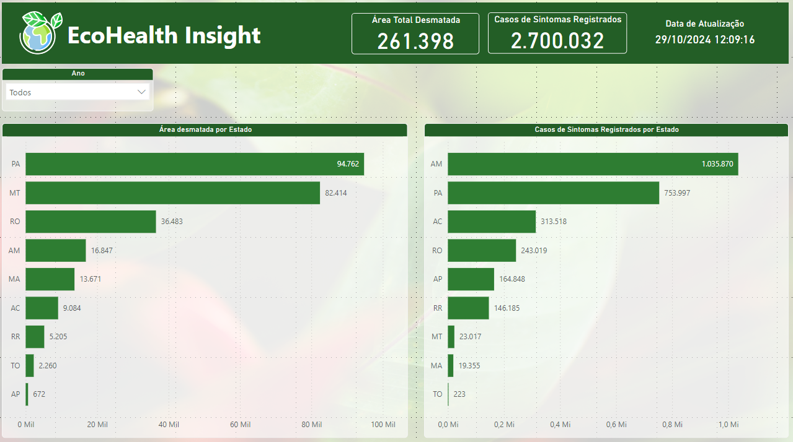

# Dashboard de Correlação entre Desmatamento e Malária - Power BI

Este repositório contém um dashboard analítico desenvolvido em Power BI que examina a correlação entre o desmatamento e o aumento dos casos de malária na Amazônia. O projeto visa fornecer insights sobre como a degradação ambiental, em especial o desmatamento, afeta a saúde pública ao influenciar a propagação da malária.

# 📊 Sobre o Projeto

O Dashboard de Correlação entre Desmatamento e Malária foi criado com o intuito de:

- Visualizar a tendência de desmatamento ao longo dos anos em diferentes áreas da Amazônia.
- Apresentar a variação nos casos de malária em correlação com as taxas de desmatamento.
- Analisar áreas específicas com maior incidência de desmatamento e aumento de casos de malária.
- Auxiliar na identificação de áreas críticas para políticas de preservação e controle de saúde.

# 🛠️ Tecnologias Utilizadas

- Power BI - Utilizado para a criação do dashboard e visualização dos dados.
- DAX - Linguagem para criação de cálculos personalizados e medidas no Power BI.
- Excel/CSV - Fonte de dados contendo informações sobre desmatamento e incidência de malária.

# 📈 Principais Métricas e KPIs

O Dashboard inclui as seguintes métricas e KPIs:

- Área total desmatada por ano.
- Número de casos de malária por ano e por região.
- Análise geográfica para identificação de hotspots de desmatamento e malária.
- Taxa de correlação entre áreas desmatadas e aumento de casos de malária.

# 📂 Estrutura do Repositório

```
|-- Data/
| |-- desmatamento.csv
| |-- malaria.csv
|-- Dashboard/
| |-- dashboard-desmatamento-malaria.pbix
|-- Public/
| |-- img/
| | |-- visao-geral.img
|-- README.MD
```

# 📷 Pré-visualização

Visão Geral:


# 🚀 Como Usar

1. Clone o repositório:

```
git clone
```

2. Acesse a pasta do projeto:

```
cd dashboard-desmatamento-malaria
```

3. Abra o arquivo .pbix no Power BI Desktop:

- Baixe o Power BI Desktop <a href="https://www.microsoft.com/pt-br/download/details.aspx?id=58494">aqui</a>
- Abra o arquivo dashboard-desmatamento-malaria para visualizar e explorar o dashboard.

# 📋 Requisitos

- Power BI Desktop instalado.
- Conexão com as fontes de dados (ou ajuste para usar os arquivos CSV incluídos).

# 🤝 Contribuições

Contribuições são sempre bem-vindas! Se você tiver sugestões de melhorias ou quiser reportar algum problema, sinta-se à vontade para abrir uma **issue** ou enviar um **pull request**.

# 👤 Autor

- **DIOGO DIAS MELLO**.
- **GABRIEL LOGAN CALANDRINI**.
- **GEOVANY MIRANDA VIEIRA**.
- **JEFFERSON BITTENCOURT AFONSO**.
- **NAILTON SAMPAIO DE OLIVEIRA**.

# 📝 Notas Finais

Este dashboard foi desenvolvido para fins de aprendizado e demonstração. Sinta-se à vontade para utilizá-lo como referência em seus próprios projetos de análise de dados e visualização.
